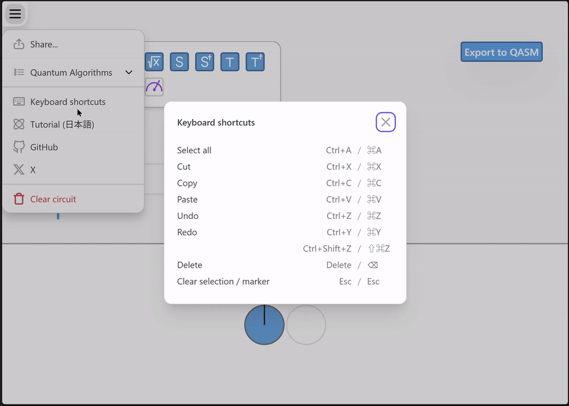

# qni-gl

## 動作確認のしかた

docker イメージを作成

```shell
docker build -f Dockerfile . -t qni-gl
```

docker イメージを起動

```shell
docker run --gpus all -p 8000:8000 --rm -it qni-gl
```

ブラウザで `http://localhost:8000/` を開く

## コピー＆ペースト機能の使い方

Qni上で選択した量子ゲートをコピーし、指定したセルの右側へ挿入できます。

コピー対象のゲートには明るい緑色の選択枠が表示されます。
コピー後にゲートまたは空セルをクリックすると、そのセルの右側へペースト位置マーカーが移動します。
ペースト位置は、セル枠ではなくステップ間のペースト位置マーカーで表示されます。
`Ctrl + V` を押すと、コピーしたゲート群がペースト位置マーカーの位置へ挿入されます。

### 基本操作

| 操作 | 内容 |
|---|---|
| ゲートをクリック | コピー対象のゲートを選択する |
| `Shift + クリック` | 複数のゲートを選択する |
| 空セルをクリック | ペースト位置マーカーをそのセルの右側へ移動する |
| 空白部分をドラッグ | 矩形に触れたゲートをまとめて選択する |
| `Ctrl + C` | 選択中のゲートをコピーする |
| `Ctrl + V` | ペースト位置マーカーの位置へコピー内容を挿入する |
| `Ctrl + Z` | 直前の回路編集を取り消す |
| `Ctrl + Y` / `Ctrl + Shift + Z` | 取り消した回路編集をやり直す |
| `Delete` / `Backspace` | 選択中のゲートを削除する |

ペーストは上書きではなく、右方向へのステップ挿入として動作します。
ペースト位置以降に既存ゲートがある場合は、接続関係を保ったまま右方向へ押し出されます。
押し出し時は、既存ゲートとCNOT・SWAPなどの縦接続線が短くスライドし、その後にペーストされたゲートが表示されます。

CNOT、CCNOT、SWAP などの接続構造を含むゲートも、相対位置と接続関係を保ってコピー＆ペーストできます。

### デモ



## .htpasswd 認証を有効にするには

`backend/merged.conf` の次の行をコメントアウト。初期パスワード userA:passA は Dockerfile の中でセットしているので、適宜書き換えてください。

```shell
# auth_basic "Restricted";
# auth_basic_user_file /etc/nginx/.htpasswd;
```

## error.logに ModuleNotFoundError: No module named 'qni'エラーが出たとき

`docker-entrypoint.sh` に以下を追加してください。

```shell
# Set PYTHONPATH to include the qni module
export PYTHONPATH=/qni-gl/backend/src:$PYTHONPATH
```

## backend.logに RuntimeError: No CUDA device available! エラーが出たとき

`docker-entrypoint.sh` に以下を追加して,CPUを使用するようにしてください。
`VITE_USE_GPU=true yarn build`　をコメントアウト

```shell
yarn build
```

` --gpus all `  オプションをはずしてrun

```shell
docker run -p 8000:8000 --rm -it -v $(pwd):/qni-gl qni-gl
```
